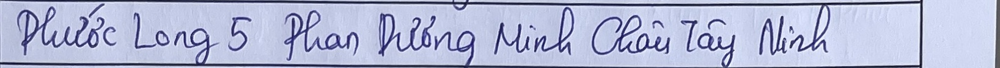
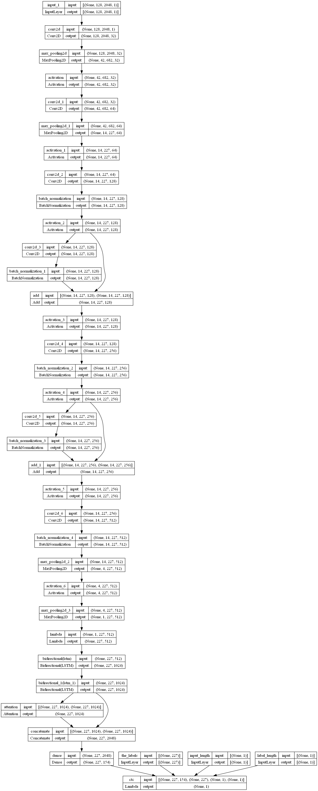

# Vietnamese Handwritten OCR Challenge

## Description

### Problem Statement

Optical Character Recognition (OCR) is a classic problem in the field of computer vision. Despite years of research, OCR for handwritten text, especially in Vietnamese, still presents significant challenges.

In this challenge, participating teams are tasked with building a lightweight OCR model to solve the problem of recognizing handwritten Vietnamese addresses.

### Input & Output

**Input:** 
- Raw images containing a line of handwritten Vietnamese address.

**Output:** 
- Extracted text from the input image.

### Examples

**Input Image:**



**Label:** Phước Long 5 Phan Dương Châu Tây Ninh

### Evaluation
Team solutions are evaluated based on the edit distance metric (Levenshtein distance). Specifically, for each test case, the team's score is calculated as follows:

Assuming the team's result is "output" and the correct label is "label":

- If the result is perfectly accurate (output == label, edit distance is 0), the team receives a score of 1.
- Otherwise, the score for the test case is calculated using the formula:

\[ \text{score} = \max \left(0, 1 - \frac{1.5^d}{n} \right) \]


where d is the edit distance between the output and label strings, and n is the length of the label string.

The team's overall score is the average score across all test cases. Teams with higher scores are ranked higher.

In case of ties, the inference model's execution time is considered. Details about resource limitations and inference time are specified in the Limitation section.

The first stage of the competition consists of two phases:

1. **Public Test:** Teams submit only the CSV result file as described. Public test scores are for reference only.
2. **Private Test:** Teams submit the source code, and the organizers will directly run the inference on the provided server. Final rankings are determined based on private test results.

For more information on edit distance, refer to [Levenshtein distance](https://en.wikipedia.org/wiki/Levenshtein_distance).

### Limitation

- **Model Size:** ≤ 50MB
- **Inference Time:** 2 seconds
- **Inference Environment:** No internet connection
- **Machine Configuration:** 
- CPU: Intel(R) Core(TM) i9-10900K CPU @ 3.70GHz
- RAM: 64GB
- **Data:** Teams are not allowed to use datasets other than those provided in the competition, except for self-generated datasets.
- **Pre-trained Model:** Only publicly available pre-trained models trained on the ImageNet dataset are allowed. Using pre-trained models specifically trained for OCR tasks (whether for printed or handwritten text) is not permitted.

## Getting Started

### Prerequisites

Before you begin, make sure you have the following installed:

- Python 3.9
- Required Python packages (listed in `requirements.txt`)

### Installation

1. Clone the repository to your local machine:

   ```bash
    git clone https://github.com/antphb/KALAPA_OCR.git

    cd KALAPA_OCR

    pip install -r requirements.txt

    python run_ocr.py --image_path path/to/your/image.jpg
    ```


### Model Showcase

Here is a snapshot of the OCR model in action:



